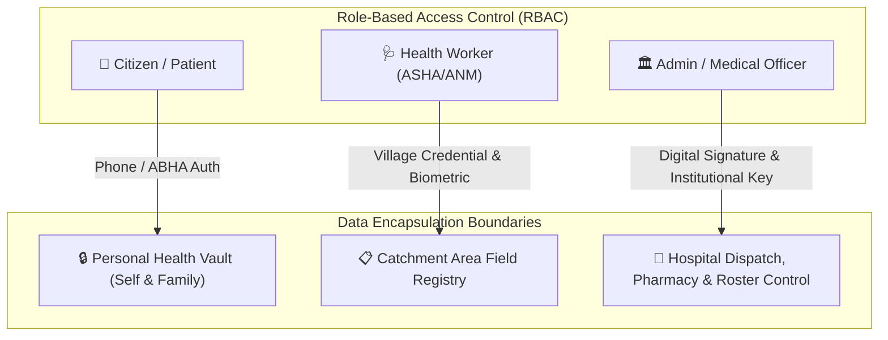
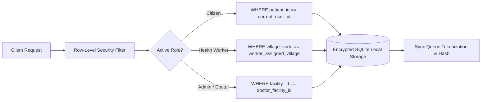
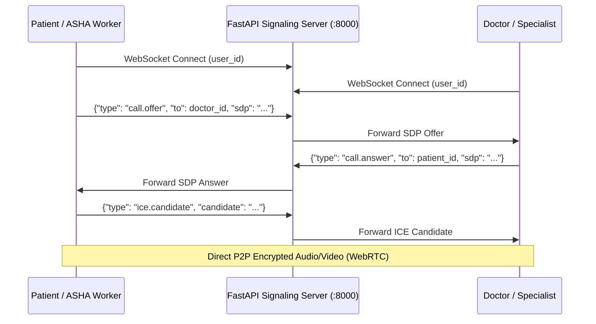

# MediReach — Master System Architecture & Platform Blueprint

> **MediReach** is a production-grade, offline-first digital healthcare continuity and tele-triage platform designed for primary healthcare centres, rural health workers, and referral hospitals.

---

## Table of Contents

1. [Executive Summary & Platform Identity](#1-executive-summary--platform-identity)
2. [Complete System Topology & Architecture](#2-complete-system-topology--architecture)
3. [Unified API Gateway & Microservices Orchestration](#3-unified-api-gateway--microservices-orchestration)
4. [User vs. Admin Feature Differentiation & RBAC Matrix](#4-user-vs-admin-feature-differentiation--rbac-matrix)
5. [Data Encapsulation, Privacy & Security Architecture](#5-data-encapsulation-privacy--security-architecture)
6. [Offline-First Data Synchronization Engine](#6-offline-first-data-synchronization-engine)
7. [Clinical Triage Engine & Machine Learning Pipeline](#7-clinical-triage-engine--machine-learning-pipeline)
8. [Database Schema — Supabase PostgreSQL & SQLite](#8-database-schema--supabase-postgresql--sqlite)
9. [Backend API Reference — Node.js Express Gateway](#9-backend-api-reference--nodejs-express-gateway)
10. [Python ML FastAPI Microservice Reference](#10-python-ml-fastapi-microservice-reference)
11. [Firebase & Cloud Push Notification Service](#11-firebase--cloud-push-notification-service)
12. [WebRTC Peer-to-Peer Teleconsultation Engine](#12-webrtc-peer-to-peer-teleconsultation-engine)
13. [Multilingual Localization & Voice TTS Architecture](#13-multilingual-localization--voice-tts-architecture)
14. [Project Directory Structure](#14-project-directory-structure)
15. [Phase-by-Phase Roadmap](#15-phase-by-phase-roadmap)

---

## 1. Executive Summary & Platform Identity

### The Mission
The public healthcare journey often suffers from fragmented data handoffs:
- **ASHA / Village Worker $\to$ Primary Health Centre (PHC)**: Manual paper records, lack of standardized triage, unrecorded vitals.
- **PHC $\to$ District / Referral Hospital**: Paper referral slips with zero arrival tracking, lack of historical clinical context.
- **Post-Consultation**: Loss to follow-up, untracked high-risk maternal/pediatric cases, unmonitored drug stock.

**MediReach** functions as the unified digital continuity layer:
- **Offline-First Clinical Capture**: Certified vitals entry, rapid diagnostics, and offline digital triage.
- **Closed-Loop Referrals**: Cryptographically tokenized QR referral passes with real-time status progression.
- **Integrated Telemedicine**: Peer-to-peer WebRTC video/audio consult with low-bandwidth fallback and adaptive network profiles.
- **Proactive Accessibility**: Multi-language localization (**English**, **తెలుగు**, **हिंदी**) and audio/TTS speech readout for low-literacy patients.

---

## 2. Complete System Topology & Architecture

```mermaid
graph TD
    subgraph "Mobile Client (Flutter)"
        App["📱 MediReach Flutter App\n(Android / iOS / Web)"]
        SQLite[("💾 Local SQLite DB\n(Offline-First Store)")]
        App <--> SQLite
    end

    subgraph "Unified Gateway Layer"
        NodeGateway["🟢 Node.js + Express API Gateway (:5000)\n(Auth, Batch Sync, CRUD, RBAC, FCM)"]
        App -->|REST / HTTPS\n(Single Base URL)| NodeGateway
    end

    subgraph "Microservices & Cloud Layer"
        MLMicroservice["🐍 Python FastAPI ML Service (:8001)\n(Triage ML + Symptom NLP + No-Show)"]
        Signaling["⚡ WebRTC Signaling Server (:8000)\n(FastAPI WebSocket)"]
        SupabaseDB[("🗄️ Supabase PostgreSQL + Auth + RLS")]
        FirebaseFCM["🔥 Firebase Cloud Messaging (FCM)"]
        
        NodeGateway -->|Internal HTTP Call| MLMicroservice
        NodeGateway <--> SupabaseDB
        NodeGateway --> FirebaseFCM
        App <-->|WebSocket Signaling| Signaling
    end
```

### Port & Service Distribution

| Service | Technology | Port | Access Scope | Purpose |
| :--- | :--- | :--- | :--- | :--- |
| **API Gateway** | Node.js + Express | `5000` | Public / App Client | Unified REST endpoints, auth, batch sync, data orchestration. |
| **ML Microservice** | Python + FastAPI + Scikit-Learn | `8001` | Private / Internal to Gateway | Clinical triage risk prediction, NLP symptom extraction, no-show scoring. |
| **Signaling Server** | Python + FastAPI + WebSockets | `8000` | Client WebRTC | PeerConnection ICE negotiation, SDP exchange, in-call chat. |
| **Cloud Database** | Supabase (PostgreSQL 15) | `5432` | Gateway only | Centralized relational store, Row-Level Security, Storage buckets. |
| **Push Notifications** | Firebase Admin SDK | Cloud | Gateway only | Outbound referral alerts, appointment reminders, high-risk notifications. |

---

## 3. Unified API Gateway & Microservices Orchestration

### Why the API Gateway Calls Python ML Internally
1. **Single Client Endpoint**: The Flutter application only connects to `http://<domain>:5000/api`. The mobile app never manages multiple hostnames, ports, or separate security tokens.
2. **Internal Service Protection**: The Python ML microservice runs strictly on the internal network (`:8001`), shielded from unauthorized public traffic.
3. **Atomic Multi-System Coordination**:
   When vitals are submitted (`POST /api/vitals`):
   ```
   [Flutter Client] ───(POST /api/vitals)───► [Node.js Gateway]
                                                     │
                                                     ├──► [Supabase] Persist raw vitals
                                                     │
                                                     ├──► [Python ML :8001] Score Triage Risk (Rules + XGBoost)
                                                     │
                                                     ├──► [Supabase] Update Triage & Draft Referral (if High Risk)
                                                     │
                                                     ├──► [Firebase FCM] Send urgent alert to Hospital Triage
                                                     │
   [Flutter Client] ◄──(Enriched Clinical Object)────┘
   ```

---

## 4. User vs. Admin Feature Differentiation & RBAC Matrix



### Detailed Capability Matrix

| Feature Domain | 👤 Citizen / Patient | 🩺 Health Worker (ASHA / ANM) | 🏛️ Admin / Medical Officer |
| :--- | :--- | :--- | :--- |
| **Authentication & Scope** | Isolated to self and registered family members. | Catchment area / Village household directory. | Institutional facility-wide & administrative jurisdiction. |
| **Vitals & Health Entry** | Self-reported vitals (preliminary flag). | Certified clinical measurement (BP, SpO2, Glucose, Temp, Pulse). | Clinical review, override, and diagnosis sign-off. |
| **Triage & Symptom Checker** | Interactive self-triage with audio/TTS assistance. | Field triage with emergency scoring (Green / Amber / Red). | Protocol configuration, emergency override & triage policy. |
| **Appointments & OPD** | Book OPD slots at PHC/CHC/District Hospitals. | Assist citizens with offline/online community booking. | Doctor roster management, queue prioritization, slot caps. |
| **Referrals & Transfers** | View personal digital referral pass & QR token. | Generate outbound facility referral with triage pass. | Inbound referral triage desk, bed assignment, case sign-off. |
| **Pharmacy & Medicines** | Search public drug availability & nearby dispensaries. | Order essential field kits (IFA, ORS, Paracetamol). | Manage stock inventory, batch tracking, expiries, restocking. |
| **Diagnostics & Lab** | View own released lab test reports & trends. | Record field point-of-care rapid test results. | Authorize laboratory reports, enter verified clinical lab panels. |
| **Teleconsultation** | Patient-side 1-on-1 WebRTC video/audio consultation. | Facilitate assisted teleconsult for rural citizens. | Physician-side consultation portal, e-prescriptions, clinical notes. |
| **Data Sync & Cache** | Sync personal health wallet when connected. | High-volume offline-first bi-directional sync engine. | Facility audit logs, aggregated surveillance, sync telemetry. |

---

## 5. Data Encapsulation, Privacy & Security Architecture



1. **Row-Level Security (RLS)**:
   - Queries at both the local SQLite repository and cloud Supabase layer automatically enforce session-bound filters (`patient_id` or `village_code`).
   - Patients cannot query other citizens' records. Field workers are scoped strictly to their assigned catchment area.
2. **Zero-Knowledge Referral QR Tokens**:
   - Referral QR codes do not embed raw unencrypted Personally Identifiable Information (PII).
   - They contain a cryptographically signed, short-lived reference token (`REF-YYYYMMDD-XXXX`) resolvable only by authenticated hospital personnel.
3. **Field-Level Masking & Differential Sync**:
   - Sensitive clinical data (reproductive health, psychiatric notes) are protected by privileged access flags.
   - Frontline sync queues push differential encrypted deltas, minimizing metadata exposure across public networks.
4. **Immutable Audit Trail**:
   - Every triage override, referral status update, and diagnostic entry writes an immutable audit record containing timestamp, user ID, and device signature.

---

## 6. Offline-First Data Synchronization Engine

```
ASHA Worker Device (Village / No Internet)
       │
       ▼
 ┌──────────────────────────┐
 │ Local SQLite Database    │  ← ALL writes commit locally first
 │ is_synced = 0            │
 └─────────────┬────────────┘
               │ Connectivity Restored (ConnectivityService)
               ▼
 ┌──────────────────────────┐
 │ SyncManager.pushQueue()  │
 └─────────────┬────────────┘
               │ POST /api/sync/batch (Idempotent upsert with deduplication)
               ▼
 ┌──────────────────────────┐
 │ Node.js Express Gateway  │ ──► [Supabase PostgreSQL]
 └─────────────┬────────────┘
               │ Realtime Broadcast
               ▼
 ┌──────────────────────────┐
 │ Receiving Hospital Desk  │  ← Real-time referral alert
 └──────────────────────────┘
```

---

## 7. Clinical Triage Engine & Machine Learning Pipeline

The triage system operates on a dual-layer architecture:

### Layer 1: Deterministic Clinical Safety Rules (Runs On-Device & On Server)
- **SpO2 < 90%** $\to$ `EMERGENCY` (Hypoxia / Respiratory distress)
- **Systolic BP > 160 mmHg in Pregnancy** $\to$ `HIGH` (Hypertensive crisis / Pre-eclampsia)
- **Pulse > 120 bpm or < 40 bpm** $\to$ `HIGH` (Severe tachycardia / bradycardia)
- **Temperature > 40.0°C (104°F)** $\to$ `HIGH` (Hyperpyrexia)

### Layer 2: Machine Learning Risk Stratification (Python FastAPI :8001)
- **Model**: Gradient Boosting / Random Forest Classifier trained on maternal & general clinical vitals datasets.
- **Features**: Age, Systolic BP, Diastolic BP, Heart Rate, SpO2, Temperature, Blood Glucose, Pregnancy Weeks, High-Risk Symptoms.
- **Output**: Risk Classification (`LOW`, `MEDIUM`, `HIGH`, `EMERGENCY`), Confidence Score ($0.0 - 1.0$), and Clinical Recommendation.

---

## 8. Database Schema — Supabase PostgreSQL & SQLite

### Core Relational Schema

```sql
-- 1. Profiles & RBAC
CREATE TABLE profiles (
    id UUID PRIMARY KEY REFERENCES auth.users(id),
    name TEXT NOT NULL,
    phone TEXT UNIQUE NOT NULL,
    role TEXT CHECK (role IN ('patient', 'health_worker', 'doctor', 'facility_admin', 'district_admin')),
    village TEXT,
    facility_id UUID REFERENCES facilities(id),
    language TEXT DEFAULT 'te',
    created_at TIMESTAMPTZ DEFAULT NOW()
);

-- 2. Facilities
CREATE TABLE facilities (
    id UUID PRIMARY KEY DEFAULT gen_random_uuid(),
    name TEXT NOT NULL,
    type TEXT CHECK (type IN ('sub_centre', 'phc', 'chc', 'sub_district_hospital', 'district_hospital')),
    district TEXT NOT NULL,
    latitude FLOAT NOT NULL,
    longitude FLOAT NOT NULL,
    phone TEXT NOT NULL,
    active_doctors INT DEFAULT 0,
    services TEXT[] DEFAULT '{}'
);

-- 3. Patients
CREATE TABLE patients (
    id UUID PRIMARY KEY DEFAULT gen_random_uuid(),
    name TEXT NOT NULL,
    dob DATE,
    gender TEXT CHECK (gender IN ('Male', 'Female', 'Other')),
    phone TEXT,
    village TEXT NOT NULL,
    district TEXT NOT NULL,
    abha_id TEXT UNIQUE,
    risk_level TEXT DEFAULT 'LOW' CHECK (risk_level IN ('LOW', 'MEDIUM', 'HIGH', 'EMERGENCY')),
    asha_worker_id UUID REFERENCES profiles(id),
    created_at TIMESTAMPTZ DEFAULT NOW(),
    is_synced BOOLEAN DEFAULT TRUE
);

-- 4. Vitals & Clinical Encounters
CREATE TABLE vitals (
    id UUID PRIMARY KEY DEFAULT gen_random_uuid(),
    patient_id UUID NOT NULL REFERENCES patients(id),
    recorded_by UUID REFERENCES profiles(id),
    systolic_bp INT,
    diastolic_bp INT,
    pulse_rate INT,
    temperature FLOAT,
    spo2 INT,
    blood_glucose FLOAT,
    triage_score TEXT CHECK (triage_score IN ('LOW', 'MEDIUM', 'HIGH', 'EMERGENCY')),
    recorded_at TIMESTAMPTZ DEFAULT NOW(),
    is_synced BOOLEAN DEFAULT TRUE
);

-- 5. Referrals & Closed-Loop Transfer
CREATE TABLE referrals (
    id UUID PRIMARY KEY DEFAULT gen_random_uuid(),
    patient_id UUID NOT NULL REFERENCES patients(id),
    referring_facility_id UUID REFERENCES facilities(id),
    receiving_facility_id UUID NOT NULL REFERENCES facilities(id),
    urgency TEXT CHECK (urgency IN ('ROUTINE', 'URGENT', 'EMERGENCY')),
    reason TEXT NOT NULL,
    qr_token TEXT UNIQUE NOT NULL,
    status TEXT DEFAULT 'PENDING' CHECK (status IN ('PENDING', 'ACCEPTED', 'IN_TRANSIT', 'COMPLETED', 'CANCELLED')),
    created_at TIMESTAMPTZ DEFAULT NOW(),
    updated_at TIMESTAMPTZ DEFAULT NOW(),
    is_synced BOOLEAN DEFAULT TRUE
);

-- 6. Appointments
CREATE TABLE appointments (
    id UUID PRIMARY KEY DEFAULT gen_random_uuid(),
    patient_id UUID NOT NULL REFERENCES patients(id),
    facility_id UUID NOT NULL REFERENCES facilities(id),
    doctor_name TEXT NOT NULL,
    specialty TEXT NOT NULL,
    appointment_date DATE NOT NULL,
    appointment_time TEXT NOT NULL,
    token_number INT NOT NULL,
    status TEXT DEFAULT 'SCHEDULED' CHECK (status IN ('SCHEDULED', 'IN_QUEUE', 'COMPLETED', 'CANCELLED')),
    created_at TIMESTAMPTZ DEFAULT NOW(),
    is_synced BOOLEAN DEFAULT TRUE
);

-- 7. Medicines & Inventory
CREATE TABLE medicines (
    id UUID PRIMARY KEY DEFAULT gen_random_uuid(),
    name TEXT NOT NULL,
    generic_name TEXT NOT NULL,
    category TEXT NOT NULL,
    dosage TEXT NOT NULL,
    form TEXT NOT NULL
);

CREATE TABLE facility_inventory (
    id UUID PRIMARY KEY DEFAULT gen_random_uuid(),
    facility_id UUID NOT NULL REFERENCES facilities(id),
    medicine_id UUID NOT NULL REFERENCES medicines(id),
    stock_quantity INT DEFAULT 0,
    unit TEXT NOT NULL,
    status TEXT CHECK (status IN ('IN_STOCK', 'LOW_STOCK', 'OUT_OF_STOCK')),
    updated_at TIMESTAMPTZ DEFAULT NOW()
);

-- 8. Diagnostic Reports
CREATE TABLE diagnostic_reports (
    id UUID PRIMARY KEY DEFAULT gen_random_uuid(),
    patient_id UUID NOT NULL REFERENCES patients(id),
    facility_id UUID REFERENCES facilities(id),
    test_type TEXT NOT NULL,
    result TEXT NOT NULL,
    unit TEXT,
    reference_range TEXT,
    status TEXT CHECK (status IN ('NORMAL', 'BORDERLINE', 'CRITICAL')),
    recorded_at TIMESTAMPTZ DEFAULT NOW(),
    is_synced BOOLEAN DEFAULT TRUE
);
```

---

## 9. Backend API Reference — Node.js Express Gateway

**Base URL**: `http://localhost:5000/api`

### Endpoints Overview

| Method | Path | Description |
| :--- | :--- | :--- |
| `GET` | `/health` | Gateway health and connected microservice statuses. |
| `POST` | `/auth/login` | Authenticate user (Phone/ABHA) and return JWT + role. |
| `POST` | `/sync/batch` | Batch sync offline SQLite records (patients, vitals, referrals, appointments). |
| `GET` | `/patients` | List patients filtered by role/catchment area. |
| `POST` | `/patients` | Register new patient. |
| `POST` | `/vitals` | Record vitals, invoke Python ML triage internally, auto-trigger emergency referrals. |
| `GET` | `/referrals` | Fetch referral list with status progression. |
| `POST` | `/referrals` | Create new closed-loop referral with signed QR token. |
| `PATCH` | `/referrals/:id/status` | Update referral status (`Accepted`, `In-Transit`, `Completed`). |
| `GET` | `/appointments` | List appointments and queue order. |
| `POST` | `/appointments` | Book appointment slot and generate queue token. |
| `GET` | `/facilities/nearby` | Query facilities by latitude, longitude, and radius. |
| `GET` | `/medicines` | Query medicines and facility-level stock inventory. |
| `GET` | `/diagnostics` | Retrieve laboratory test reports for a patient. |

---

## 10. Python ML FastAPI Microservice Reference

**Base URL**: `http://localhost:8001` (Internal Microservice)

### Endpoints

- `POST /triage`:
  ```json
  // Request
  {
    "age": 28,
    "systolic_bp": 165,
    "diastolic_bp": 105,
    "pulse_rate": 98,
    "temperature": 37.2,
    "spo2": 96,
    "is_pregnant": true,
    "pregnancy_weeks": 32,
    "symptoms": ["severe_headache", "blurred_vision"]
  }
  
  // Response
  {
    "risk_level": "HIGH",
    "confidence": 0.94,
    "flag": "Pre-eclampsia Alert",
    "recommended_action": "Immediate referral to Obstetric Specialist at District Hospital",
    "eval_source": "deterministic_safety_rules + ml_classifier"
  }
  ```
- `POST /extract-symptoms`: Multilingual NLP symptom extraction mapping Telugu/Hindi/English to standardized clinical codes.
- `POST /predict-noshow`: Predicts follow-up non-compliance probability to optimize ASHA task prioritization.

---

## 11. Firebase & Cloud Push Notification Service

### Notification Channels
1. **Emergency Referral Alert**: High-priority alert sent to receiving hospital's emergency desk when `HIGH`/`EMERGENCY` triage is submitted.
2. **Appointment Reminder**: Timely SMS/Push reminder to patients before scheduled OPD visits.
3. **Follow-Up Task**: Automated notification to village ASHA worker when a discharged patient requires home monitoring.

---

## 12. WebRTC Peer-to-Peer Teleconsultation Engine



- **Adaptive Network Profiles**: Automatic downgrade from HD Video $\to$ SD Video $\to$ Audio-Only on 2G/3G low-bandwidth connections.
- **TURN Relay**: Metered Cloud TURN fallback for strict NAT/firewall traversal.

---

## 13. Multilingual Localization & Voice TTS Architecture

- **Supported Languages**: English (`en`), Telugu (`te`), Hindi (`hi`).
- **Instant Toggle**: Top-bar instant switcher in `HomeScreen`.
- **Text-to-Speech (TTS)**: `tts_helper.dart` providing spoken voice assessment in the patient's native dialect for low-literacy accessibility.

---

## 14. Project Directory Structure

```
miracle/
├── MASTER_ARCHITECTURE.md            # Master System Architecture Document
├── pubspec.yaml                      # Flutter Dependencies & Assets
├── lib/
│   ├── main.dart                     # App Entry Point & Session Routing
│   ├── core/
│   │   ├── audio/                    # TTS Voice Assistant (tts_helper.dart)
│   │   ├── localization/             # Multilingual Engine (app_localizations.dart)
│   │   ├── remote/                   # ApiClient, RemoteSyncService, SupabaseClient
│   │   ├── session/                  # Persistent SessionManager
│   │   ├── shell/                    # MainShell Navigation
│   │   └── theme/                    # Centralized Design Tokens (app_theme.dart)
│   ├── data/
│   │   ├── local/                    # SQLite DbHelper (5 tables + demo seeder)
│   │   ├── models/                   # Core Domain Models (models.dart)
│   │   └── repositories/             # PatientRepository
│   └── features/
│       ├── appointment/              # Appointment Booking & Queue
│       ├── diagnostics/              # Lab Reports & Entry
│       ├── facilities/               # GPS Nearby Facilities & Dialer
│       ├── home/                     # Home Dashboard
│       ├── medicines/                # Pharmacy Inventory & Search
│       ├── patient/                  # Patient List, Profile, Registration, Vitals
│       ├── referral/                 # Referral Creation & Lifecycle Tracker
│       ├── sync/                     # Offline Sync Queue Telemetry
│       ├── teleconsult/              # Doctor Directory & Video Calling Hub
│       └── triage/                   # Digital Clinical Triage
└── backend/
    ├── node_api/                     # Node.js + Express API Gateway (:5000)
    │   ├── package.json
    │   ├── server.js
    │   ├── config/                   # Supabase & Firebase initializers
    │   ├── middleware/               # Auth & RBAC
    │   └── routes/                   # sync, patients, vitals, referrals, appointments
    ├── ml_service/                   # Python FastAPI ML Microservice (:8001)
    │   ├── requirements.txt
    │   ├── ml_server.py
    │   ├── triage_engine.py
    │   ├── symptom_nlp.py
    │   └── noshow_predictor.py
    ├── database/                     # PostgreSQL & Firebase Schemas
    │   └── supabase_schema.sql
    └── server.py                     # WebRTC WebSocket Signaling Server (:8000)
```

---

## 15. Phase-by-Phase Roadmap

- **Phase 0 — Foundation & Design System (Completed)**: Theme tokens, SQLite offline storage, models, session routing, WebRTC preservation.
- **Phase 1 — Core Clinical Patient Flow (Completed)**: Registration, vitals entry, triage engine, patient profile timeline, referrals & QR generation.
- **Phase 2 — System Integration & Facilities (Completed)**: Nearby GPS healthcare locator, appointment booking, teleconsultation hub, offline sync queue.
- **Phase 3 — Accessibility & Comprehensive Platform (Completed)**: Multilingual (EN/TE/HI), TTS voice guidance, pharmacy inventory, lab diagnostics.
- **Phase 4 — Cloud & ML Backend Services (In Progress)**:
  1. Python FastAPI ML microservice implementation (:8001).
  2. Node.js Express API Gateway (:5000) with Supabase + Firebase + ML proxy.
  3. Supabase SQL Schema deployment with Row-Level Security.
  4. Flutter client remote integration and live cloud synchronization.
