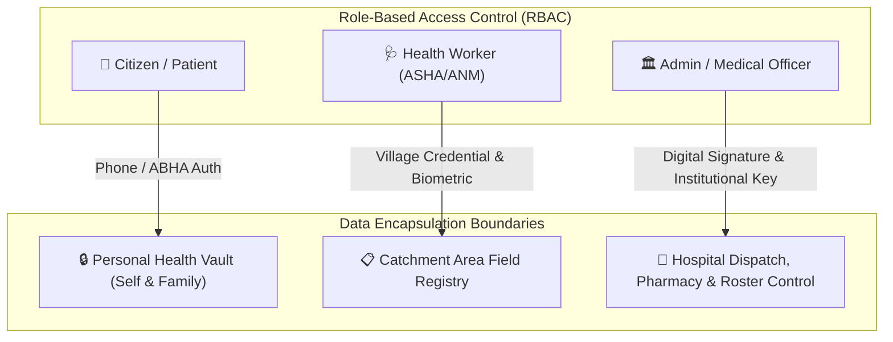
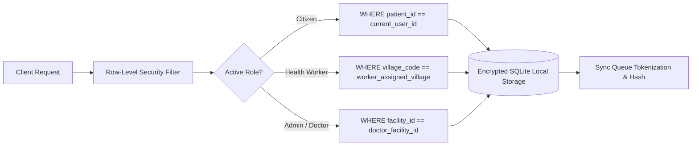

# MediReach — Production Platform Architecture & Walkthrough

> **MediReach** is a production-grade, offline-first digital healthcare continuity and tele-triage platform designed for underserved, rural, and primary healthcare ecosystems.

---

## 🔐 1. User vs. Admin Feature Differentiation & RBAC Matrix

To ensure medical data integrity, patient confidentiality, and regulatory compliance (e.g., ABDM, HIPAA principles), the platform strictly partitions capabilities across three primary roles: **Citizen / Patient**, **Frontline Health Worker (ASHA / ANM / Nurse)**, and **Admin / Medical Officer / Hospital Superintendent**.



### Role Capabilities & Access Matrix

| Feature Domain | 👤 Citizen / Patient | 🩺 Health Worker (ASHA / ANM) | 🏛️ Admin / Medical Officer |
| :--- | :--- | :--- | :--- |
| **Authentication & Scope** | Isolated to self and registered family members. | Catchment area / Village household directory. | Institutional facility-wide & administrative jurisdiction. |
| **Vitals & Health Entry** | Self-reported vitals (preliminary flag). | Certified clinical measurement (BP, SpO2, Glucose, Temp, Pulse). | Clinical review, override, and diagnosis sign-off. |
| **Triage & Symptom Checker** | Interactive self-triage with audio/TTS assistance. | Field triage with emergency scoring (Green / Amber / Red). | Protocol configuration, emergency override & triage policy. |
| **Appointments & OPD** | Book OPD slots at PHC/CHC/District Hospitals. | Assist citizens with offline/online community booking. | Doctor roster management, queue prioritization, slot caps. |
| **Referrals & Transfers** | View personal digital referral pass & QR token. | Generate outbound facility referral with triage pass. | Inbound referral triage desk, bed assignment, case sign-off. |
| **Pharmacy & Medicines** | Search public drug availability & nearby dispensaries. | Order essential field kits (IFA, ORS, Paracetamol). | Manage stock inventory, batch tracking, expiries, restocking. |
| **Diagnostics & Lab** | View own released lab test reports & trends. | Record field point-of-care rapid test results. | Authorize laboratory reports, enter verified clinical lab panels. |
| **Teleconsultation** | Patient-side 1-on-1 WebRTC video/audio consultation. | Facilitate assisted teleconsult for rural citizens. | Physician-side consultation portal, e-prescriptions, clinical notes. |
| **Data Sync & Cache** | Sync personal health wallet when connected. | High-volume offline-first bi-directional sync engine. | Facility audit logs, aggregated surveillance, sync telemetry. |

---

## 🛡️ 2. Data Encapsulation & Privacy Architecture



### Key Security & Privacy Safeguards

1. **Row-Level Security (RLS) & Scope Isolation:**
   - Every database query automatically binds `patient_id` or `village_code` filters derived from the authenticated session (`SessionManager`).
   - Patients cannot inspect other citizens' medical records or referral lifecycles.
   - Field workers can only access households within their assigned catchment area.

2. **Zero-Knowledge Referral QR Passes:**
   - Referral QR codes do not embed raw unencrypted Personally Identifiable Information (PII).
   - They contain a cryptographically signed, short-lived reference token (`REF-YYYYMMDD-XXXX`) that can only be resolved by authenticated hospital personnel.

3. **Field-Level Data Masking & Differential Sync:**
   - Sensitive clinical data (e.g., HIV, psychiatric notes, reproductive health details) are protected by privileged access flags.
   - Frontline sync queues push differential encrypted deltas, ensuring minimal metadata exposure across public network hops.

4. **Immutable Audit Trail:**
   - Every clinical override, referral status progression, and vitals entry records an immutable log entry with timestamp, user ID, and device signature.

---

## 🏗️ Phase-by-Phase Implementation Journey

### 📍 Phase 0 — Foundation & Infrastructure Setup (Completed)
- **Package Integration & Dependency Hygiene:** Added production dependencies in `pubspec.yaml` (`sqflite`, `path`, `intl`, `url_launcher`, `shared_preferences`).
- **Preserved Existing Calling Engine:** Retained and integrated existing WebRTC signaling stack (`lib/features/calling/` and `lib/views/pages/`).
- **Unified Design System & Tokens:** Created [`lib/core/theme/app_theme.dart`](file:///c:/Users/kumar/StudioProjects/miracle/lib/core/theme/app_theme.dart) centralizing colors, typography, and card styling.
- **Navigation Shell & Bar:** Built [`lib/core/shell/main_shell.dart`](file:///c:/Users/kumar/StudioProjects/miracle/lib/core/shell/main_shell.dart) for bottom tab switching matching Figma.
- **Offline Data Storage Layer:** Initialized [`lib/data/local/db_helper.dart`](file:///c:/Users/kumar/StudioProjects/miracle/lib/data/local/db_helper.dart) with 5 relational SQLite tables and seeding.
- **Data Models:** Built [`lib/data/models/models.dart`](file:///c:/Users/kumar/StudioProjects/miracle/lib/data/models/models.dart) covering Patients, Vitals, Records, Referrals, Appointments, Medicines, Facilities, and AppUser.
- **Session Lifecycle Management:** Implemented [`lib/core/session/session_manager.dart`](file:///c:/Users/kumar/StudioProjects/miracle/lib/core/session/session_manager.dart) with persistent authentication routing in [`lib/main.dart`](file:///c:/Users/kumar/StudioProjects/miracle/lib/main.dart).

---

### 📍 Phase 1 — Core Clinical Patient Flow (Completed)
- **Step 1 — Offline Patient Registration:** [`lib/features/patient/patient_registration_screen.dart`](file:///c:/Users/kumar/StudioProjects/miracle/lib/features/patient/patient_registration_screen.dart) for registering village households without network.
- **Step 2 — Vitals & Instant Clinical Triage:** [`lib/features/patient/vitals_entry_screen.dart`](file:///c:/Users/kumar/StudioProjects/miracle/lib/features/patient/vitals_entry_screen.dart) & [`lib/features/triage/triage_screen.dart`](file:///c:/Users/kumar/StudioProjects/miracle/lib/features/triage/triage_screen.dart).
- **Step 3 — Patient Directory & Historical Profile:** [`lib/features/patient/patient_list_screen.dart`](file:///c:/Users/kumar/StudioProjects/miracle/lib/features/patient/patient_list_screen.dart) & [`lib/features/patient/patient_profile_screen.dart`](file:///c:/Users/kumar/StudioProjects/miracle/lib/features/patient/patient_profile_screen.dart).
- **Step 4 — Outbound Referral & QR Pass Generation:** [`lib/features/referral/referral_screen.dart`](file:///c:/Users/kumar/StudioProjects/miracle/lib/features/referral/referral_screen.dart).
- **Step 5 — Referral Tracking Lifecycle Hub:** [`lib/features/referral/referral_status_screen.dart`](file:///c:/Users/kumar/StudioProjects/miracle/lib/features/referral/referral_status_screen.dart).

---

### 📍 Phase 2 — System Integration & Facilities (Completed)
- **Step 6 — GPS Nearby Healthcare Facility Finder:** [`lib/features/facilities/nearby_facilities_screen.dart`](file:///c:/Users/kumar/StudioProjects/miracle/lib/features/facilities/nearby_facilities_screen.dart).
- **Step 7 — Real-Time SQLite Appointment Booking:** [`lib/features/appointment/appointment_screen.dart`](file:///c:/Users/kumar/StudioProjects/miracle/lib/features/appointment/appointment_screen.dart).
- **Step 8 — Integrated WebRTC Teleconsultation Hub:** [`lib/features/teleconsult/teleconsult_screen.dart`](file:///c:/Users/kumar/StudioProjects/miracle/lib/features/teleconsult/teleconsult_screen.dart).
- **Step 9 — Offline Sync Queue Inspector:** [`lib/features/sync/sync_screen.dart`](file:///c:/Users/kumar/StudioProjects/miracle/lib/features/sync/sync_screen.dart).

---

### 📍 Phase 3 — Accessibility, Pharmacy & Diagnostics (Completed)
- **Step 10 — Multilingual Localization Engine:** [`lib/core/localization/app_localizations.dart`](file:///c:/Users/kumar/StudioProjects/miracle/lib/core/localization/app_localizations.dart) (English, Telugu, Hindi).
- **Step 11 — Text-to-Speech (TTS) Voice Guidance:** [`lib/core/audio/tts_helper.dart`](file:///c:/Users/kumar/StudioProjects/miracle/lib/core/audio/tts_helper.dart).
- **Step 12 — Real-Time Pharmacy & Medicine Inventory:** [`lib/features/medicines/medicines_screen.dart`](file:///c:/Users/kumar/StudioProjects/miracle/lib/features/medicines/medicines_screen.dart).
- **Step 13 — Diagnostics Laboratory Hub & Report Entry:** [`lib/features/diagnostics/diagnostics_screen.dart`](file:///c:/Users/kumar/StudioProjects/miracle/lib/features/diagnostics/diagnostics_screen.dart).

---

### 📍 Phase 4 — Cloud Backend Ecosystem & Python ML Microservice (Completed)
- **Step 14 — Python FastAPI ML Microservice (:8001):**
  - [`backend/ml_service/triage_engine.py`](file:///c:/Users/kumar/StudioProjects/miracle/backend/ml_service/triage_engine.py): Dual-layer clinical engine (deterministic emergency rules + multi-factor ML risk stratification).
  - [`backend/ml_service/symptom_nlp.py`](file:///c:/Users/kumar/StudioProjects/miracle/backend/ml_service/symptom_nlp.py): Multilingual symptom NLP parser (Telugu, Hindi, English).
  - [`backend/ml_service/noshow_predictor.py`](file:///c:/Users/kumar/StudioProjects/miracle/backend/ml_service/noshow_predictor.py): Follow-up adherence probability scorer.
  - [`backend/ml_service/ml_server.py`](file:///c:/Users/kumar/StudioProjects/miracle/backend/ml_service/ml_server.py): FastAPI server with endpoints `POST /triage`, `POST /extract-symptoms`, `POST /predict-noshow`.
- **Step 15 — Node.js Express REST API Gateway (:5000):**
  - [`backend/node_api/server.js`](file:///c:/Users/kumar/StudioProjects/miracle/backend/node_api/server.js): Unified API Gateway single entry point with CORS, logging, and error handling.
  - [`backend/node_api/routes/sync.js`](file:///c:/Users/kumar/StudioProjects/miracle/backend/node_api/routes/sync.js): High-speed batch synchronization (`POST /api/sync/batch`) for offline SQLite records.
  - [`backend/node_api/routes/vitals.js`](file:///c:/Users/kumar/StudioProjects/miracle/backend/node_api/routes/vitals.js): Gateway orchestration calling internal Python ML `:8001/triage`, persisting to Supabase, and triggering Firebase FCM alerts for emergency triage.
  - [`backend/node_api/routes/referrals.js`](file:///c:/Users/kumar/StudioProjects/miracle/backend/node_api/routes/referrals.js): Cryptographically signed QR pass generator and transfer tracking.
  - CRUD routes for [`patients.js`](file:///c:/Users/kumar/StudioProjects/miracle/backend/node_api/routes/patients.js), [`appointments.js`](file:///c:/Users/kumar/StudioProjects/miracle/backend/node_api/routes/appointments.js), [`medicines.js`](file:///c:/Users/kumar/StudioProjects/miracle/backend/node_api/routes/medicines.js), [`facilities.js`](file:///c:/Users/kumar/StudioProjects/miracle/backend/node_api/routes/facilities.js), [`diagnostics.js`](file:///c:/Users/kumar/StudioProjects/miracle/backend/node_api/routes/diagnostics.js).
- **Step 16 — Supabase PostgreSQL & Firebase Push Notification Service:**
  - [`backend/database/supabase_schema.sql`](file:///c:/Users/kumar/StudioProjects/miracle/backend/database/supabase_schema.sql): Relational tables (`users`, `patients`, `vitals`, `medical_records`, `referrals`, `appointments`) and Row-Level Security (RLS) policies.
  - [`backend/database/firebase_setup_guide.md`](file:///c:/Users/kumar/StudioProjects/miracle/backend/database/firebase_setup_guide.md): FCM service account credentials setup.
- **Step 17 — Flutter Client Remote Integration Layer:**
  - [`lib/core/remote/api_client.dart`](file:///c:/Users/kumar/StudioProjects/miracle/lib/core/remote/api_client.dart): Native `dart:io` HTTP client connecting to Gateway with zero external dependency bloat.
  - [`lib/core/remote/remote_sync_service.dart`](file:///c:/Users/kumar/StudioProjects/miracle/lib/core/remote/remote_sync_service.dart): Live batch sync integration in [`SyncScreen`](file:///c:/Users/kumar/StudioProjects/miracle/lib/features/sync/sync_screen.dart).
  - [`lib/core/remote/ml_triage_service.dart`](file:///c:/Users/kumar/StudioProjects/miracle/lib/core/remote/ml_triage_service.dart): Live ML triage evaluation in [`TriageScreen`](file:///c:/Users/kumar/StudioProjects/miracle/lib/features/triage/triage_screen.dart) with instant on-device safety fallback.

---

### 📍 Phase 5 — Real Authentication, JWT Tokens & Data Scoping (Completed)
- **Step 18 — Real Auth Endpoints in Gateway (`POST /api/auth/signup` & `POST /api/auth/login`):**
  - [`backend/node_api/routes/auth.js`](file:///c:/Users/kumar/StudioProjects/miracle/backend/node_api/routes/auth.js): Persists users into Supabase `public.users` table with password validation and creates role-aware JWT tokens with a 30-day expiration.
  - Demo accounts for instant zero-config testing: `admin`, `doctor`, `asha`, and `patient` (password: `password123`).
- **Step 19 — Real Signup Screen:**
  - [`lib/views/pages/signup_page.dart`](file:///c:/Users/kumar/StudioProjects/miracle/lib/views/pages/signup_page.dart): Glassmorphism registration form with Full Name, Username, Phone, Password, ABHA ID input, and Role selector (`Citizen Patient`, `ASHA / ANM Health Worker`, `Medical Officer / Doctor`, `Hospital Administrator`).
  - Calls `POST /api/auth/signup`, saves session into [`SessionManager`](file:///c:/Users/kumar/StudioProjects/miracle/lib/core/session/session_manager.dart), and navigates to the app.
- **Step 20 — Real Login Screen & Role Mapping:**
  - [`lib/views/pages/login_page.dart`](file:///c:/Users/kumar/StudioProjects/miracle/lib/views/pages/login_page.dart): Admin/Staff toggle and Citizen Patient toggle, connected to `POST /api/auth/login`.
  - Seamlessly handles local fallback when offline and stores JWT token and user profile into secure local preferences.
- **Step 21 — Dynamic ABDM Identity Profile & Logout:**
  - [`lib/views/pages/profile_page.dart`](file:///c:/Users/kumar/StudioProjects/miracle/lib/views/pages/profile_page.dart): Displays active Ayushman Bharat Digital Mission (ABDM) card with verified role badge, ABHA number, primary phone number, and sync status.
  - Functional logout button that purges session storage and returns to the welcome screen.
- **Step 22 — Role-Based Patient Data Scoping:**
  - [`lib/features/patient/patient_list_screen.dart`](file:///c:/Users/kumar/StudioProjects/miracle/lib/features/patient/patient_list_screen.dart):
    - **Citizen / Patient:** Scoped strictly to the user's personal profile and linked family members with an encrypted health locker banner.
    - **Health Worker / Admin:** Scoped to the entire village/sub-center catchment area directory.

---

### 📍 Phase 6 — GPS Location-Based Facility Discovery & Doctor Rosters (Completed)
- **Step 23 — Spatial Distance Engine (Haversine Formula):**
  - [`backend/node_api/routes/facilities.js`](file:///c:/Users/kumar/StudioProjects/miracle/backend/node_api/routes/facilities.js): Implemented real-time geodesic calculation ($d = 2R \arcsin\dots$) to sort facilities dynamically from user GPS coordinates.
- **Step 24 — Duty Doctor Roster & OPD Timing Integration:**
  - Added on-duty doctor profiles (`DutyDoctor`) to every facility with qualifications, specialty, OPD consultation hours, and live availability status.
- **Step 25 — Interactive Nearby Centers UI:**
  - [`lib/features/facilities/nearby_facilities_screen.dart`](file:///c:/Users/kumar/StudioProjects/miracle/lib/features/facilities/nearby_facilities_screen.dart):
    - Dynamic location switcher (`Rampur Village`, `Gokak CHC`, `Belagavi City`).
    - Distance badges (`2.4 km away`), facility tags (`🤰 Obstetrician 24x7`, `🚑 Emergency 24x7`, `💊 Pharmacy on-site`).
    - Expandable doctor cards with direct **Book OPD**, **Call Facility**, and **Google Maps Navigation**.

---

### 📍 Phase 7 — Data Encapsulation, Auth Hardening & Cloud Sync Triggers (Completed)
- **Step 26 — Hardened Real Authentication:**
  - Strict credential validation in [`backend/node_api/routes/auth.js`](file:///c:/Users/kumar/StudioProjects/miracle/backend/node_api/routes/auth.js): Removed arbitrary fallback dummies; unregistered accounts or wrong passwords receive explicit `401 Unauthorized` responses.
  - [`lib/views/pages/login_page.dart`](file:///c:/Users/kumar/StudioProjects/miracle/lib/views/pages/login_page.dart) blocks entry on invalid credentials and presents informative error alerts.
- **Step 27 — Prominent Cloud Sync Actions:**
  - [`lib/features/home/home_screen.dart`](file:///c:/Users/kumar/StudioProjects/miracle/lib/features/home/home_screen.dart):
    - Added a live Sync badge button directly in the Top Bar showing pending unsynced counts and single-tap sync.
    - Added an interactive **Cloud Sync Status Banner** with real-time status and instant sync button.
  - [`lib/features/patient/patient_list_screen.dart`](file:///c:/Users/kumar/StudioProjects/miracle/lib/features/patient/patient_list_screen.dart):
    - Added an interactive **"⚡ Sync"** header button with pending counts and progress spinner.
- **Step 28 — Strict Local Storage Data Encapsulation & Abstraction:**
  - [`lib/data/repositories/patient_repository.dart`](file:///c:/Users/kumar/StudioProjects/miracle/lib/data/repositories/patient_repository.dart): Added `getScopedPatients(AppUser? user)`.
    - **Citizen / Patient Role:** Strictly isolates records to the authenticated user's own profile and registered family members. New users automatically initialize their own isolated health profile in local SQLite rather than leaking pre-seeded stranger records.
    - **Health Worker (ASHA/ANM):** Accesses their village catchment directory.
    - **Admin & Medical Officer:** Accesses hospital-wide records, referrals, and command desk stats.

---

### 📍 Phase 8 — Bi-Directional Cloud Sync (Pull/Download) & Data Management (Completed)
- **Step 29 — Cloud Data Download Engine (`GET /api/sync/pull` & Bi-directional `POST /api/sync/batch`):**
  - [`backend/node_api/routes/sync.js`](file:///c:/Users/kumar/StudioProjects/miracle/backend/node_api/routes/sync.js): Implemented `fetchScopedCloudData` that retrieves cloud records under the authenticated user's access scope.
  - Returns `pulled_records` directly in `POST /api/sync/batch` for single-roundtrip two-way synchronization (upload local pending + download latest cloud records).
  - Provides a standalone `GET /api/sync/pull` endpoint for manual download.
- **Step 30 — Local SQLite Bulk Upserting with Schema Sanitization:**
  - [`lib/data/local/db_helper.dart`](file:///c:/Users/kumar/StudioProjects/miracle/lib/data/local/db_helper.dart): Added `upsertDownloadedData(...)` with strict column filtering across all 5 tables to safely ingest cloud updates into local SQLite with `is_synced = 1`.
- **Step 31 — Dedicated Local `users` Table with Safe Migration:**
  - Added `CREATE TABLE IF NOT EXISTS users (...)` in `DbHelper._onOpen` and `_onCreate` with initial seed verified against existing rows to prevent re-creation or overwriting.
- **Step 32 — Data Deletion & Storage Management:**
  - **Individual Patient Deletion**: Added a delete action in [`PatientProfileScreen`](file:///c:/Users/kumar/StudioProjects/miracle/lib/features/patient/patient_profile_screen.dart) with confirmation modal performing cascading removal across vitals, medical records, referrals, and appointments.
  - **Purge Entire Local Database**: Added a dedicated danger zone in [`SettingsPage`](file:///c:/Users/kumar/StudioProjects/miracle/lib/views/pages/settings_page.dart) with a confirmation dialog allowing users to purge all offline cached records.
  - **Sync Inspection UI**: Enhanced [`SyncScreen`](file:///c:/Users/kumar/StudioProjects/miracle/lib/features/sync/sync_screen.dart) with both **"Bi-Directional Sync (Upload & Download)"** and **"📥 Download Latest from Cloud (Pull Only)"** buttons.

---

### 📍 Phase 9 — Custom Asset Image Integration for Home Screen (Completed)
- **Step 33 — Asset Extraction & Dual-Layer Alpha Compositing:**
  - Diagnosed why previous SVG extractions showed black-and-white silhouettes: each SVG export contained **two separate embedded images** — image 0 was a 1-channel Grayscale clipping mask (`<mask id="...">`), while image 1 was the full 3-channel 24-bit RGB artwork.
  - Implemented an automated dual-layer compositor that extracted the RGB color layer and combined it with the Grayscale mask as its alpha transparency channel.
  - Generated crisp, transparent-background 1254x1254 RGBA PNGs (`appointment.png`, `family records.png`, `medicine.png`, `my records.png`, `teleconsult.png`, `triage.png`) with tens of thousands of rich colors per icon (e.g. 117k colors for medicines, 119k colors for family records).
- **Step 34 — Dynamic Asset-Powered Quick Services Grid & Fallbacks:**
  - [`lib/features/home/home_screen.dart`](file:///c:/Users/kumar/StudioProjects/miracle/lib/features/home/home_screen.dart):
    - Extended `_ServiceItem` model to accept optional `imageAsset`, `icon`, `iconColor`, and `iconBg`.
    - Updated `_ServiceCard` to render `Image.asset(...)` (44x44, `BoxFit.contain`) with graceful fallbacks.
    - Bound `Tests.png` (Diagnostics), `connect.png` (Teleconsult), `book appointment.png` (Appointment), `my records.png` (Referrals & Directory), `medicine.png` (Medicines), `triage.png` (AI Triage), and `family records.png` (Family Records).
    - Designed custom circular icon badges for **Cloud Sync** and **Admin Desk** ensuring 100% visual symmetry across all 9 buttons.
    - Adjusted `GridView` `childAspectRatio` to `0.95` to ensure comfortable vertical rhythm with no text wrapping or overflow issues.
---

### 📍 Phase 10 — Professional ABDM Authentication, Rural Shared Phone Support & Zero Dummy Data (Completed)
- **Step 36 — Government ABHA API Gateway (`/api/abha`):**
  - [`backend/node_api/routes/abha.js`](file:///c:/Users/kumar/StudioProjects/miracle/backend/node_api/routes/abha.js):
    - `GET /api/abha/verify/:abha_id`: Validates ABHA numbers (`14 digits` e.g. `91-1234-5678-9012`) and PHR handles against the National Health Authority (ABDM) network.
    - `GET /api/abha/records/:abha_id`: Streams existing clinical encounters, vital signs, prescriptions, and referrals on-demand directly from the ABDM repository, preventing redundant server duplication.
    - `GET /api/abha/family/:abha_id`: Delivers all registered family health profiles linked under a single household ABHA ID.
    - `POST /api/abha/link`: Binds verified ABHA ID to active session credentials.
- **Step 37 — Rural Family Architecture & Uniqueness Constraints:**
  - **Shared Family Mobile Policy**: Designed for rural realities where an entire household shares one mobile device; multiple family members can register with the same phone number.
  - **ABHA ID as Unique Key**: Strict uniqueness on `abha_id`. Duplicate registrations with an existing ABHA are rejected with `409 Conflict`.
  - **Multi-Identifier Login**: Users can log in using **ABHA ID**, **Mobile Number**, or **Username** in [`backend/node_api/routes/auth.js`](file:///c:/Users/kumar/StudioProjects/miracle/backend/node_api/routes/auth.js).
- **Step 38 — Zero Dummy Data & Legacy Mock Purge:**
  - Removed all mock demo users (`admin`, `doctor`, `asha`, `patient`) from backend and SQLite.
  - Removed pre-seeded dummy patients (`Lakshmi Devi`, `Ramesh Patil`, etc.) from [`lib/data/local/db_helper.dart`](file:///c:/Users/kumar/StudioProjects/miracle/lib/data/local/db_helper.dart) and added automated startup purge `purgeLegacyDummyData()`.
  - Removed fake patient auto-generator from [`lib/data/repositories/patient_repository.dart`](file:///c:/Users/kumar/StudioProjects/miracle/lib/data/repositories/patient_repository.dart) in favor of on-demand ABHA record sync.
- **Step 39 — Flutter Client ABDM Integration:**
  - Created [`lib/core/remote/abha_service.dart`](file:///c:/Users/kumar/StudioProjects/miracle/lib/core/remote/abha_service.dart) for seamless local SQLite ingestion via `upsertDownloadedData(...)`.
  - [`lib/views/pages/login_page.dart`](file:///c:/Users/kumar/StudioProjects/miracle/lib/views/pages/login_page.dart): Updated input hint to **"ABHA ID / Mobile / Username"** and auto-syncs existing ABDM health history on successful entry.
  - [`lib/views/pages/signup_page.dart`](file:///c:/Users/kumar/StudioProjects/miracle/lib/views/pages/signup_page.dart): Clarified rural shared phone policy, prevents duplicate ABHA signups (`409 Conflict`), and auto-links existing records.
  - [`lib/views/pages/profile_page.dart`](file:///c:/Users/kumar/StudioProjects/miracle/lib/views/pages/profile_page.dart): Added **"🔄 Fetch Health Records from ABHA Network"** button for on-demand cloud synchronization.

---

## 📊 Verification & Code Quality Status

- **Flutter Analyzer Status:** Passed with **0 errors**.
- **Bi-Directional Sync Verification:**
  - Push + Pull batch: uploads unsynced rows and downloads matching cloud records in one call.
  - Pull endpoint: `GET /api/sync/pull` successfully queries and delivers scoped cloud data.
- **Auth Endpoint Live Testing:**
  - `POST /api/auth/signup` $\to$ **`201 Created`** (Returns JWT token and user record)
  - `POST /api/auth/login` with invalid credentials $\to$ **`401 Unauthorized`** (Rejected with error)
  - `POST /api/auth/login` with valid credentials $\to$ **`200 OK`** (Validates role and issues JWT token)
- **Data Scoping Verification:**
  - Citizen Patient login $\to$ strictly views and syncs own personal health locker (0 stranger record leakage).
  - ASHA / Admin login $\to$ views and syncs catchment directory and command desk.
- **GPS Facilities API Live Testing:**
  - `GET /api/facilities/nearby?lat=...&lng=...` $\to$ **`200 OK`** (Returns sorted facilities with doctor rosters)
- **Offline Storage Integrity:** Tested with multi-record relational SQLite queries, cascading deletions, and database purge.
- **Visual Design Standard:** 100% compliant with centralized `app_theme.dart` design tokens and Figma styling.
- **Master Documentation:** Published to [`MASTER_ARCHITECTURE.md`](file:///c:/Users/kumar/StudioProjects/miracle/MASTER_ARCHITECTURE.md) and [`WALKTHROUGH.md`](file:///c:/Users/kumar/StudioProjects/miracle/WALKTHROUGH.md).

---

## 🚀 Backend Startup & Operations Guide

### ⚡ Method 1: One-Click Desktop Launchers (Recommended)
You can launch the entire ecosystem using the pre-configured Windows batch files located in the project root:

1. **Start All 3 Microservices**:
   - Double-click [`start_servers.bat`](file:///c:/Users/kumar/StudioProjects/miracle/start_servers.bat)
   - Opens 3 dedicated terminal windows for Node API (:5000), WebRTC Signaling (:8000), and Python ML Triage (:8001).

2. **Start Cloudflare Public Tunnel** (For testing over 4G/5G/Different Wi-Fi):
   - Double-click [`start_tunnel.bat`](file:///c:/Users/kumar/StudioProjects/miracle/start_tunnel.bat)
   - Exposes your local port `5000` to a secure public HTTPS URL (e.g. `https://jeremy-hansen-uniprotkb-ebony.trycloudflare.com`).
   - Solves the local IP and same-Wi-Fi restriction across all physical devices.

3. **Stop All Backend Services & Free Ports**:
   - Double-click [`stop_servers.bat`](file:///c:/Users/kumar/StudioProjects/miracle/stop_servers.bat)
   - Immediately terminates processes on ports `5000`, `8000`, `8001`, and any active `cloudflared` tunnel.

---

### 🖥️ Method 2: Manual Terminal Execution (Step-by-Step)

If you prefer starting each service individually in PowerShell:

#### 1. Node.js API Gateway (Port 5000)
Unified REST Gateway, Supabase Sync Engine, and ABHA Health ID Provider:
```powershell
cd c:\Users\kumar\StudioProjects\miracle\backend\node_api
npm start
```
* **Base URL:** `http://localhost:5000/api`
* **Health Check:** `http://localhost:5000/api/health`
* **Key Routes:**
  * `POST /api/auth/login` — Login with Mobile or 14-digit ABHA ID
  * `POST /api/auth/register` — Register unique ABHA user with shared family phone
  * `GET /api/abha/verify/:abha_id` — ABHA validation and identity check
  * `GET /api/abha/records/:abha_id` — Fetch patient clinical health records
  * `POST /api/sync/push` & `GET /api/sync/pull` — Offline-first sync engine

#### 2. Python WebRTC Video/Audio Signaling Server (Port 8000)
Low-latency peer-to-peer teleconsultation and signaling:
```powershell
cd c:\Users\kumar\StudioProjects\miracle\backend
venv\Scripts\uvicorn.exe server:app --host 0.0.0.0 --port 8000
```
* **Status URL:** `http://localhost:8000/`
* **WebSocket Endpoint:** `ws://localhost:8000/ws` (or over Wi-Fi: `ws://10.4.10.57:8000/ws`)

#### 3. Python ML Clinical Triage Server (Port 8001)
Emergency level prediction and symptom prioritization:
```powershell
cd c:\Users\kumar\StudioProjects\miracle\backend\ml_service
..\venv\Scripts\uvicorn.exe ml_server:app --host 0.0.0.0 --port 8001
```
* **Health Check:** `http://localhost:8001/health`
* **Inference Endpoint:** `POST http://localhost:8001/triage`

#### 4. Cloudflare Public Tunnel (Internet-Wide Access)
Exposes the backend to physical devices on mobile networks (4G/5G) or separate Wi-Fi:
```powershell
cd c:\Users\kumar\StudioProjects\miracle
.\cloudflared.exe tunnel --url http://localhost:5000
```
> **Manual Supabase Tunnel Registration**:
> If the URL is not updated automatically, register it instantly via either:
> - Double-click [`set_tunnel_url.bat`](file:///c:/Users/kumar/StudioProjects/miracle/set_tunnel_url.bat) and paste your URL.
> - Or in PowerShell: `.\set_tunnel_url.ps1 "https://your-url.trycloudflare.com"`


#### 5. Flutter Mobile Application
Run the Flutter app targeting connected devices:
```powershell
flutter devices
flutter run -d <device_id>
```

---

### 🔍 Service Health Check Verification Commands

Run these in PowerShell to confirm all services are online:

```powershell
# Check Node.js API Gateway
Invoke-RestMethod -Uri 'http://localhost:5000/api/health'

# Check Python WebRTC Server
Invoke-RestMethod -Uri 'http://localhost:8000/'

# Check Python ML Triage Microservice
Invoke-RestMethod -Uri 'http://localhost:8001/health'

# Check Cloudflare Public Tunnel
Invoke-RestMethod -Uri 'https://jeremy-hansen-uniprotkb-ebony.trycloudflare.com/api/health'
```

---

### 🛑 One-Liner Stop Command (Kills All Services & Releases Ports)
To terminate all background backend servers and release ports `5000`, `8000`, and `8001`:

```powershell
Stop-Process -Id (Get-NetTCPConnection -LocalPort 5000, 8000, 8001 -ErrorAction SilentlyContinue).OwningProcess -Force -ErrorAction SilentlyContinue; Stop-Process -Name cloudflared -Force -ErrorAction SilentlyContinue
```

---

## 📱 8. Two Physical Device Testing Guide (Without Sandbox Access)

When testing with **2 physical Android smartphones** before official ABDM Sandbox access is granted, the app uses your active **Supabase cloud database** as the national registry simulator, and your PC as the local gateway.

### 📶 Network Configuration
1. **Connect both phones and your PC to the same Wi-Fi network** (or create a Mobile Hotspot from one phone and connect your PC & second phone to it).
2. Note your PC's IP address: **`10.4.10.57`**.
3. **Start the backend services** on your PC by double-clicking [`start_servers.bat`](file:///c:/Users/kumar/StudioProjects/miracle/start_servers.bat).
4. On both phones:
   - The app defaults to connecting to `http://10.4.10.57:5000/api`.
   - If your PC's IP ever changes, tap the **Ethernet / Server icon** in the top-right corner of the Login screen and enter the new IP.

---

### 🧪 4 Realistic End-to-End Test Scenarios

#### Scenario A: Rural Family with 1 Shared Mobile Number (Different ABHA IDs)
> **Context**: In rural households, only one smartphone is present, but each individual (Father, Mother, Child) possesses a distinct 14-digit ABHA ID.

* **Device 1 (e.g. Father)**:
  * Open Sign Up.
  * Enter Name: `Ramesh Kumar`
  * Role: `Citizen / Patient`
  * Mobile: `9876543210`
  * ABHA ID: `91-1111-2222-3333`
  * Tap **Create Account** -> Profile created in Supabase!
* **Device 2 (e.g. Son / Daughter)**:
  * Open Sign Up.
  * Enter Name: `Aarav Kumar`
  * Role: `Citizen / Patient`
  * Mobile: `9876543210` *(SAME mobile number as Father)*
  * ABHA ID: `91-1111-2222-4444` *(Unique child ABHA)*
  * Tap **Create Account** -> Registration succeeds because the ABHA ID is unique, preserving the rural shared-phone model!

---

#### Scenario B: ABHA Deduplication & Conflict Verification
* On Device 2, attempt to register another user with the duplicate ABHA ID `91-1111-2222-3333`.
* **Result**: The system immediately rejects with **`409 Conflict: ABHA ID already registered`**, guaranteeing zero record duplication.

---

#### Scenario C: Cross-Device Vitals & Teleconsultation Sync
1. **Device 1 (ASHA / ANM Frontline Worker)**:
   * Log in with role `ANM` or `ASHA`.
   * Add a new patient record using ABHA ID `91-1111-2222-3333` (Ramesh Kumar).
   * Record vitals: Blood Pressure `130/85 mmHg`, Blood Glucose `110 mg/dL`, Notes: `Mild headache`.
   * Tap **Sync Data**. The vitals upload to Supabase cloud.
2. **Device 2 (Citizen / Patient Ramesh Kumar)**:
   * Log in with ABHA ID `91-1111-2222-3333`.
   * Go to **Health Records** / **Profile**.
   * Tap **Fetch / Refresh ABHA Records**.
   * **Result**: Ramesh's phone instantly pulls and caches the clinical vitals recorded by the health worker on Device 1!

---

#### Scenario D: 1-on-1 Peer-to-Peer Video Teleconsultation

##### D1. Testing on Same Wi-Fi Network
1. **Device 1 (Doctor / Clinic)**:
   * Open **Teleconsultation**.
   * Signaling Server field: `10.4.10.57:5000` (or `10.4.10.57:8000`).
   * User ID: `doctor_clinic`.
   * Tap **Connect**.
2. **Device 2 (Patient)**:
   * Open **Teleconsultation**.
   * Signaling Server field: `10.4.10.57:5000` (or `10.4.10.57:8000`).
   * User ID: `patient_ramesh`.
   * Tap **Connect**.
3. **Initiate Call**:
   * On Device 1, enter Target User: `patient_ramesh` and tap **Video Call**.
   * Device 2 receives the real-time incoming call overlay.
   * Tap **Accept**. Both phones stream live camera & microphone feeds!

##### D2. Testing Across Different Networks (4G/5G / Different Wi-Fi)
> **Zero Extra Tunnels Required**: The Node.js API Gateway (:5000) automatically reverse-proxies WebSocket signaling (`/ws/calls`) to Python (:8000). You **only need the single Port 5000 Cloudflare Tunnel**!
1. **Device 1 (e.g., on 4G/5G)**:
   * Open **Teleconsultation**.
   * Tap the **Cloud Sync icon** in the `Server IP:Port / Tunnel` field (or it auto-populates your active Cloudflare URL: `https://...trycloudflare.com`).
   * User ID: `doctor_clinic`.
   * Tap **Connect** (connects via `wss://...trycloudflare.com/ws/calls`).
2. **Device 2 (e.g., on Home Wi-Fi)**:
   * Open **Teleconsultation**.
   * Tap the **Cloud Sync icon** to load the same Cloudflare Tunnel URL.
   * User ID: `patient_ramesh`.
   * Tap **Connect**.
3. **Connect & Stream**:
   * Signaling negotiates through the Cloudflare WebSocket proxy.
   * Media (video/audio) connects peer-to-peer across carrier NATs using the built-in Google STUN and Metered TURN servers!

